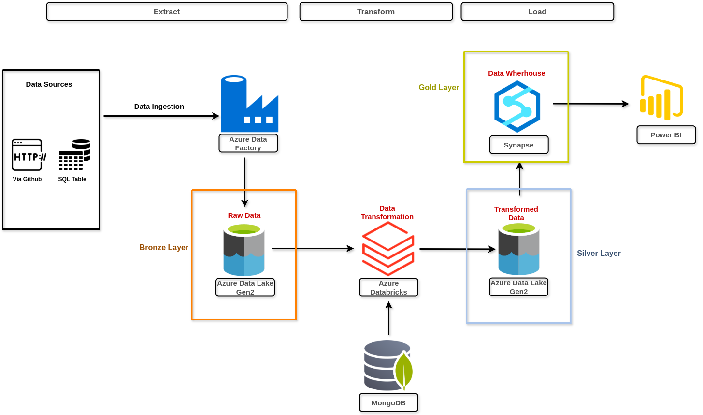

# End-to-End-Big-Data-Engineering-Project-with-Azure
## Overview
This project demonstrates the implementation of a complete Big Data architecture on Azure. It covers data ingestion, storage, processing, and visualization using services such as Azure Data Lake, Azure Data Factory, Databricks, and Synapse Analytics. The goal is to build a scalable and optimized data pipeline for analysis and value extraction.

## Architecture Diagram

## Project Goals
1. Data Ingestion — Build a mechanism to ingest data from different sources
2. ETL System — We are getting data in raw format, transforming this data into the proper format
3. Data lake — We will be getting data from multiple sources so we need centralized repo to store them
5. Cloud — We can’t process vast amounts of data on our local computer so we need to use the cloud, in this case, we will use Azure
6. Reporting — Build a dashboard to get answers business questions

## Services we will be using
1. Azure Data Factory: Azure Data Factory is a fully managed data integration service that enables orchestration and automation of data movement and transformation workflows at scale.

2. Azure Data Lake Gen2: A storage service optimized for big data analytics, combining Azure Blob Storage capabilities with data lake-specific features to efficiently manage massive volumes of data.

3. Azure Databricks: A data analytics platform based on Apache Spark that allows processing large-scale data for AI, machine learning, and big data workloads.

4. Azure Synapse Analytics: A cloud-based analytics service that integrates big data and data warehousing, providing powerful SQL-based analytics and Spark-based processing for large-scale data analysis.

5. Power BI: A business intelligence (BI) service that enables data visualization, interactive dashboards, and AI-driven insights to help organizations make data-driven decisions
   
## Dataset Used
This dataset was generously provided by Olist, the largest department store in Brazilian marketplaces. Olist connects small businesses from all over Brazil to channels without hassle and with a single contract. Those merchants are able to sell their products through the Olist Store and ship them directly to the customers using Olist logistics partners. See more on our website: www.olist.com

After a customer purchases the product from Olist Store a seller gets notified to fulfill that order. Once the customer receives the product, or the estimated delivery date is due, the customer gets a satisfaction survey by email where he can give a note for the purchase experience and write down some comments.

https://www.kaggle.com/datasets/olistbr/brazilian-ecommerce

